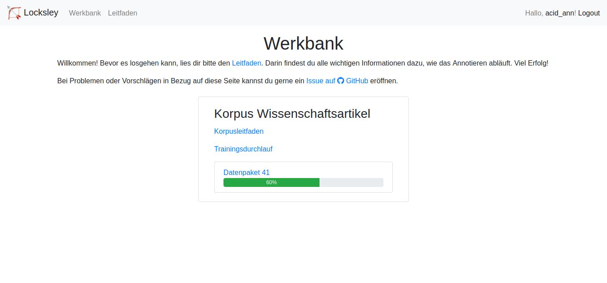

# Locksley :bow_and_arrow:
A minimalist web-based annotation tool for relation extraction. The interface is in German.




## Deployment with docker
The web interface is deployed with the help of Docker and docker compose. Before using this repo, make sure both are installed.

There are three main components to the deployment process: `Dockerfile`, `docker-compose.yml` and `sample.env`.
`Dockerfile` contains all internal settings of the virtualisation container for the web interface.
`docker-compose.yml` coordinates the settings for the web interface and the database with all annotation data.
To do so, the yml file uses environment variables from `sample.env`. If you want to deploy Locksley yourself, you will probably want to customise `sample.env`, e. g. the superuser and password settings for the database.
Use the following command to start the Docker containers for the interface and the database:
```
$ docker-compose up -d
```
Use the following command to stop the services:
```
$ docker-compose down
```

## Annotation data
The sentences in the `data` folder are all part of the 10kGNAD corpus that is released under a Creative Commons BY-NC-SA 4.0 license (www.github.com/tblock/10kGNAD). As a result, the sentences here are equally made available under CC BY-NC-SA 4.0 (https://www.creativecommons.org/licenses/by-nc-sa/4.0/). 

You load the annotation data into the datasets by using the scripts in the `django-unchained/annotation/management/commands` directory.
First, you need to add the `data` directory as a volume to the annotation service in your docker-compose file (cf. example docker-compose.yml in the root folder).
Afterwards, you can execute the scripts as follows:
```
$ docker-compose run annotation [name_of_the_script]
```

Please note that the order in which the different types of data points are loaded matters:
1. `load_corpora.py`
2. `load_relation_types.py`
3. `load_testruns.py`
4. `load_sentences.py`
5. `load_batches.py`
